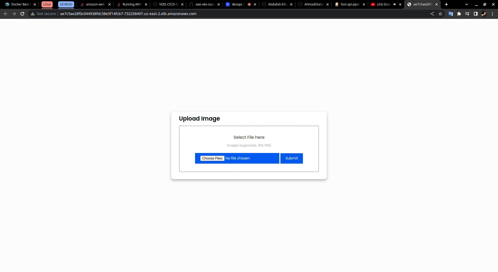

# Instance Segmentation API Using FasterRCNN in ONNX format using FastAPI

## Introduction

This documentation provides an overview of the Instance Segmentation API project. The project aims to serve an instance segmentation model called FasterCNN using the FastAPI framework. The model is based on the ONNX framework and the API utilizes async functionality for improved performance.

## Project Components

The project consists of the following components

- Instance Segmentation Model: The model used for instance segmentation is FasterCNN. It is an efficient convolutional neural network       (CNN) architecture capable of detecting and segmenting instances in an image.

- FastAPI: FastAPI is a high-performance web framework for building APIs with Python. It is used to create the API endpoint that serves the instance segmentation model.

- ONNX: ONNX (Open Neural Network Exchange) is an open format for representing deep learning models. The FasterCNN model is based on the ONNX framework, allowing easy interoperability with various deep learning frameworks.

- Async: The project utilizes async functionality, which enables asynchronous execution of tasks. This improves the performance of the API by allowing multiple requests to be processed concurrently.

## Setup using virtual environement

To set up and deploy the Instance Segmentation API project, follow these steps:

1. Create a virtual enviroment 
    * `python -m venv venv`

2. Activate the virtual enviroment 
    * on windows use `./venv/Scripts/activate`
    * on linux use `source venv/Scripts/bin`

3. Install the required dependencies, including FastAPI, ONNX, and any other necessary libraries.
    * `pip install -r requirements.txt`

4. Run the FastAPI server using Uvicorn after opening the directory containgy the `server.py` file 
    * `uvicorn server:app`

 

## Setup using Docker

Docker must be installed on your system

1. Create the image using
    * `Docker build . --tag fast-api-model`

2. Run the container mapped to port 8080 on Host using 
    *  `Docker run --name api -p 8080:80 fast-api-model`

2. Access the api on
    * `http://localhost:8080`

### Request Format

The API endpoint expects a JSON payload in the body of the POST request. The payload should include the following fields:

- `"upload/img"` (required): The input image to be segmented. It supports formats (JPEG, PNG).

## Usage Example 

## Conclusion

The Instance Segmentation API project provides a simple and efficient way to perform instance segmentation on images using the FasterCNN model. By leveraging FastAPI, ONNX, and async functionality.
